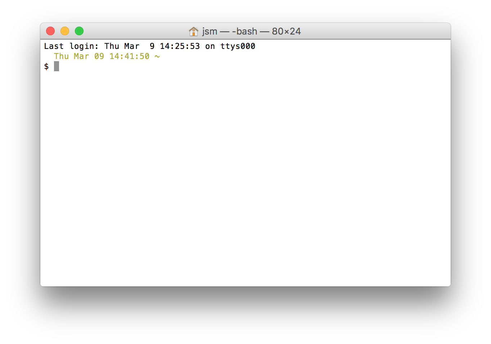

# The CLI (Command Line Interface)

## Learning Objectives

- Define and explain the strengths and weaknesses of GUIs and CLIs
- Learn how to access the terminal and break down its components
- Describe the file system and how it relates to the CLI
- Introduce common commands and list unsafe ones
- Learn how to find more information on using commands
- Introduce Bash and how to customize the command line

## Framing (15 minutes)

We are used to interacting with computers by means of a graphical user interface (GUI). A GUI lets us tell computers what we would like for them to do using a cursor and presents a strong visual representation of a subject matter. This is wonderful for getting information from the computer because "a picture is worth a thousand words". GUIs leverage our natural intuition about space and images.

While GUIs are fantastic at presenting information, this is at a cost. GUIs are expensive in a few ways.

- GUIs are computationally expensive (though a manageable task for modern personal computers)
- GUIs require a lot of work to design and implement
- Related to the last, it is extremely difficult to design a GUI to do something beyond what the creator conceived of

By using precise language to issue commands, these expenses are reduced and we are afforded the ability to issue exact and powerful instructions.

**Turn & Talk:** Given your exposure to the Command Line in the pre-work and Installfest, spend **5 minutes** discussing and writing down a few answers for the following questions with a partner.

* How is the CLI different from the GUI?
* What do you like / dislike about using it?
* Compared to a GUI, in what ways might using the CLI be better or worse for developers?

---------------------------------------------------------------------------

### Benefits of the CLI

**Power/Speed.** Many tasks can be accomplished much faster using the CLI. Features such as tab completion,
command history, piping (sending the output of one program to another for additional processing) and more all contribute to this.

**Precision.** We can look at the commands we're about to enter and understand exactly what they will do.

**Repeatability / Scriptability.** We can easily save commands and re-use them, or even share them with others.

What you did during Installfest was run a set of scripts that we shared with you!

**Tools.** There are tons of tools (programs really) we can run from the CLI. Most of them are built in, but we can also download external ones using services like Homebrew (OSX) and `apt-get` (Linux).

Tools built for the command line usually follow something called the ['Unix philosophy'](http://catb.org/esr/writings/taoup/html/#id2807216), meaning each tool should do one thing and do it well. Complex tasks can be achieved by chaining tools together.

**Debugging.** Whenever we get an error in the CLI, it will often come with a lot of information that we can use to then debug it. As developers, this is preferable to what can often be unhelpful GUI errors


## CLI Basics (15 minutes)

### The Terminal and the Shell

How do we get at this text-based interface from our GUI desktop? We run what's called a terminal application (also often referred to as a terminal emulator). The default on OSX is `Terminal.app`. When you open a new Terminal window, the Terminal app will call a program called a **shell**.

A shell is a program that takes commands, passes them to the operating system and returns any output or errors. The default shell used by terminal is called **Bash**. There are other shells but all operate very similarly.

Let's fire up our terminals and get exploring!

### Getting Oriented

First, open Terminal by clicking the icon on your dock, finding the application in Applications > Utilities > Terminal, or using Spotlight (**&#x2318; + SPC**)

You should see the following prompt (which we customized at installfest)


The prompt is the shell asking for input; when you see `$ <something>` in documentation, it generally means, input this command into a shell.

If you have a terminal open but do not see a prompt, that means that the shell is not ready to receive input.

Typing a random string of characters and hitting enter will produce a message `-bash: <your-random-string>: command not found`


> What is a command?

A command is a program. Some come built into the shell and provide the basics for interacting with the operating system and some are written by programmers (like you!) to provide further functionality.


## File Systems(45 minutes)

You are likely already familiar with the idea of a hierarchical directory structure (we will use the term **directory** for what is commonly referred to as a *folder*) - the idea that directories contain sub-directories, and are themselves contained by a parent directory. This creates a tree structure.

On our machines, at the very top level of this tree is a directory called the **root directory** signified by `/`.

The directories at the root of the file system are used for general system configuration and functionality. There are some protections in place to try to prevent a user unwittingly breaking anything at this level but these protections are primarily aimed at GUI users. Ultimately, it's your machine and you should be able to do what you want with it so it is certainly in your power to cause considerable trouble.

A running shell is always in the context of some directory called the working directory. The first command we'll discuss is `pwd` which stands for "print working directory". This is asking "where am I?"

Most commands function relative to your working directory so "what is my current working directory?" should be the question you ask yourself before you do anything. For convenience, the command line prompt will frequently show the name of your working directory

When working on the command line and something unexpected happens, many times you'll find that it's because you're not in the directory where you thought you where. `pwd` early and often.

### Navigating the File System

For this section, we will compare file system navigation and representation between the GUI and the CLI. Open `Finder` and, if you don't already have one, a terminal window. Arrange the windows so that you can see both at the same time.

In recent versions of OS X, the finder opens to an "All My Files" pseudo-folder (it doesn't really exist). If you'd like the behavior to more closely mirror the shell's behavior (starting in the **Home Directory**), this can be changed in the Finder preferences (the name of the home directory will vary depending on your username but the icon will be a house).

On Unix machines (like OS X), `~` is shorthand for your home directory - `/Users/you`.

## Paths

### What is a [Path](https://en.wikipedia.org/wiki/Path_(computing))?

A path specifies the location of a particular file or folder in a file system.

A location can be specified by a relative path or an absolute path.

> What would you expect the difference to be based on names?

### Absolute Paths

An **absolute path** is the sequence of all directories from the root to a particular file using the `/` symbol as a delimiter between directories.

You may have noticed that `pwd` returns not just the name of the current directory but the whole absolute path. Why is the name of the current directory alone not particularly helpful?

We can think of an absolute path like this very specific mailing address of our classroom:

```
Classroom 1
GA
8th Floor
1133 15th St NW
Washington, DC 20003
USA
```

Expressed as a path the address might look something like this:

```bash
; General Assembly in path form...
/USA/Washington_DC/20003/1133_15th_St_NW/8th_Floor/GA/Classroom_1
```

An absolute path can be expressed in terms of the `~` shorthand for the home directory by appending the rest of the path after the home directory to the tilda

```bash
; this path written using short hand
~/wdi/lessons/cli-intro

; is the same as this path written out
/Users/your_username/wdi/lessons/cli-intro
```

> What are some reasons having a short hand for the user directory might be important?


### Exploring the file system

There are a few commands that will very useful to us in our exploration

We have already talked about `pwd` which outputs the name of the current working directory ("print working directory").

> After we know where we are, what's the next piece of information we might require?

The `ls` command lists the files in the current working directory.

And crucial to exploring, we will need to change the working directory which we can do with `cd` ("change directory").

#### A bit more about `ls` and `cd`

On its own, `cd` will change the directory to the home directory. We can also provide it a directory name to change to that directory.

We can modify commands' behavior using **options** (which we will discuss the specifics of below). Two useful options for `ls` are `-a` which includes hidden files with names beginning with `.`, and `-l` which lists files in long form (including some information about the files)

### Relative Paths

> Let's talk a little about the argument we provide to `cd`

Relative paths are interpreted as starting from the current working directory. In order to be explicit, we can begin them with `./`

> How is this more clear?

So if we were in our home directory, the path to this lesson's directory could be written in the following ways...

```bash
wdi/lessons/cli-intro                                   # relative
./wdi/lessons/cli-intro                                 # relative
~/wdi/lessons/cli-intro                                 # absolute
/Users/generalassembly/wdi/lessons/cli-intro               # absolute
```

Keep in mind these special directories' meanings:
* `.` - one dot refers to the current directory
* `..` - two dots refers to the parent directory

So if we're in `~/wdi/lessons`, then the relative path `../projects` means "go up one level to the wdi folder, then down into my `projects` directory.

> Spend a few minutes with someone sitting near you writing out what the following commands are doing in English...

1. `$ pwd`
2. `$ cd ./lessons`
3. `$ ls ..`
4. `$ cd ../..`
5. `$ mv ../index.html .`

## [You Do: Directory Tree](https://ga-wdi-exercises.github.io/dc_directory_tree/)

### Output and Side Effects

Some commands have **output**, which is displayed on the screen for us to see. Examples of commands that have output are...

* `pwd`
* `ls`
* `brew install tree`.

Other commands' primary purpose is to execute some **side-effect**, or in other words, to make some change that isn't necessarily printed in the Terminal after hitting enter.

Often times, a command whose main job is a side effect may not provide any output if it succeeds. If there is an error, it will provide output (we would get an error if there were a problem so no news is good news).

> What's an example of this we've already seen?

Another example would be `touch`. This command creates a file in an indicated location. We do not, however, get a confirmation it did this immediately after hitting enter.

> Related to touch, what do you think `mkdir` does?

Some commands may provide both an output and side effects.

### Command Syntax

Commands generally consist of three parts

1. Command
2. Options
3. Arguments

The **Command** is the first word you type into the CLI (e.g. `ls`, `cd`, or `touch`). Think of it as the "verb" which indicates what we want to do.

Next come the **Options**, sometimes called flags or switches.
* Sometimes you won't be using any options. Other times you may use several
* By convention, options will start with a dash or two; one if the option is a single letter and two for the "long" name
* Sometimes an option takes an argument. In these cases, the argument comes right after the option

Finally come the **Arguments**. These are "targets", or what you want to do the action to. These could be file names, URLs, etc.

#### Common Patterns

The commands entered into the CLI are often in one of the following forms..

- `doSomething --how toFiles`
- `doSomething --how sourceFile destinationFile`

Where **doSomething** is, in effect, a verb, **how** an adverb (for example, should the command be executed "verbosely" or "quietly") and **toFiles** an object or objects (typically one or more files) on which the command should act.

Not all commands follow this pattern, but many do.

Let's take a look at something we did for installfest.

```
$ brew install git
```

When we type this command and hit enter, we're saying, "Computer, we're about to do something with homebrew. The thing were going to do is install something. What we want to install is git.

> Spend 2 minutes writing down the commands, options, and arguments for each of the below commands. (some may not have flags and/or arguments.)
  1. `$ touch index.html`
  2. `$ ls -al`
  3. `$ cp index.html index2.html`
  4. `$ brew install git`
  5. `$ mkdir -p lessons/sandbox`


## WDI Environment (5 minutes)

### Directory Structure

Here's the suggested structure for your WDI folder. Please create the following folders if they do not exist.

  * ~/wdi
    * sandbox
    * homework
    * labs
    * projects


### Getting Help

There are three general ways to get help with a command.

* Add `--help` or `-h` to the end of the command (e.g., `brew --help`).
* Use the manual -- or `man` -- tool (e.g., `man brew`).
* Google!

The man will display the man pages using a program `less`. Use the arrow keys to navigate. Type `q` to quit. Use `/` to search and `n` and `p` to go to the next or previous search result


--------------------------------------------------------------------------------
## BREAK (10 minutes)
--------------------------------------------------------------------------------

### Common Command Teachbacks (25 minutes)

> 15 minutes preparation. 10 minutes review.

Form groups of 3 and spend 10 minutes researching and preparing a short demo of your command. Focus on...

* What it does.
* Common uses.
* Common flags or arguments.
* Any "gotchas" (i.e., things we should be aware of when using this command)?

#### Commands

1. `ls`
2. `cd`
3. `touch` and `mkdir`
4. `cp`
5. `mv`
6. `rm`
7. `atom`/`apm` OR `code`
8. `sudo`

## Unsafe Commands (5 minutes)

### `sudo`

`sudo` -- or "super user do" -- runs the command that follows as the super user (i.e., 'root' or 'admin'). That means your computer will not prevent you from running the command and may not even confirm if this is what you actually want to do. This is of particular concern when the command may have destructive effects.

> Generally, you shouldn't need to run commands with `sudo` in this course. If you're not sure, ask an instructor.

### `rm`

`rm` -- or "remove" -- deletes files with no confirmation. There is no `trash` to recover removed files
from.  So use `rm` with caution.

You should especially use `rm -rf` with caution.

> Based on your knowledge of flags, what does `rm -rf` do?


## Keyboard Shortcuts (5 minutes)

The next three points are reasons not to hold down the arrow or delete keys.

### `ctrl-c`

Cancel whatever you were typing before. Abort!

### `ctrl-e`

Move cursor to the end of the line.

### `ctrl-a`

Move cursor to the beginning of the line

### The up and down arrows

Cycle through previous commands

### Tab completion

When typing a command that has a file as an argument, like `cd`,
type only the first few letters and hit the TAB key.

### Clear the screen

- ctrl-l
- command-k
- `clear`

--------------------------------------------------------------------------------

## Homework: To Oz

[To Oz](https://git.generalassemb.ly/ga-wdi-exercises/to_oz)

#### Submission Instructions

1. Go to the assignment's [issues page](https://git.generalassemb.ly/ga-wdi-exercises/to_oz/issues).
2. Click 'New Issue’.
3. Give it a title of `CLI HW (Your Name Here)`. Replace "Your Name Here" with your actual name.
4. For the description, copy paste the CLI commands you used to complete the assignment.

## Additional Practice

- [Command Line Fu](https://github.com/ga-wdi-exercises/command_line_fu)
- [Kitchen Organizer](https://github.com/ga-wdi-exercises/kitchen_organizer)

--------------------------------------------------------------------------------

## Bash Profile Aliases (Bonus Content)

You may have noticed during Installfest that we messed with this file: `~/.bash_profile`.

<details>
  <summary> <b>Q:</b> Based on the path, where is this file located?</summary>
  In the home directory (i.e., Users/your-name-here).
</details>

Essentially, we changed the `~/.bash_profile` to make your prompt into a better one!

There will be commands you will find yourself doing frequently. It might become a pain to type out these commands in full all the time. It would be really nice if we could shorten some of these commands... enter aliasing. Aliasing is really quite simple!

Let's open our  `~/.bash_profile` in atom and type in the following...

```
alias greeting="echo 'hello world'"
alias gs='git status'
alias sbx='cd ~/wdi/sandbox'
```

We can also design functions in bash to allow for arguments and options...
```
cdls () {
cd "$@" && ls;
}
```

> At this point you may be wondering what exactly "bash" is. Bash is a language we can use to interact with our computer via the shell (via Terminal or some other text-based interface).

### Make An Alias

Take the next five minutes to create your own alias and test it. If possible, alias something you think you'll find yourself doing frequently!

--------------------------------------------------------------------------------

## Sample Quiz Questions

* Why would a developer prefer the command line over a GUI?
* Where can we find help for shell commands?
* Describe 4 bash commands for managing folders and files.
* Describe 2 unsafe commands.
* You are currently in the "code" folder in the below file tree. How would you get to the folder that contains "beach.png" using the command line?

```
home
├── documents
│   └── code
├── photos
│   ├── headshot.jpg
│   └── summer_vacation_2014
│       └── beach.png
└── videos
```

* **BONUS:** Write a command to list only files beginning with your first name. Label the parts of the command.

## Hungry for More?

* `grep`
* `cat`
* `less`
* `find`
* `cal`
* `vim` and `vimtutor`

[Linux Command](http://linuxcommand.org/) is a wonderful introduction to the command line. Macs are Unix systems and so very similar to Linux. Almost everything (everything I've found so far)

## Own your terminal

1. [Color your prompt](http://www.cyberciti.biz/faq/bash-shell-change-the-color-of-my-shell-prompt-under-linux-or-unix/)
  - It will be WAY easier to read
2. [Choose a theme](http://apple.stackexchange.com/a/92769)
  - Pick something you like to look at

## [iTerm2](https://www.iterm2.com/features.html)

Some instructors use iTerm2 as a terminal replacement.

Our favorite features include:

- A better, more readable font
- Hotkey support (full screen and tabs)
- Unlimited Scroll Back history

## Feeling Adventurous?

Bash isn't the only option. Check out zsh (http://code.joejag.com/2014/why-zsh.html) or fish (http://fishshell.com/)

## Glossary

*  **Prompt** — is a sequence of (one or more) characters used in a command-line interface to indicate readiness to accept commands. Its intent is to literally prompt the user to take action. A prompt usually ends with one of the characters `$`, `%`, `#`, `:`, `>` and often includes other information, such as the path of the current working directory.

*  **Arguments(Parameters)** — are items of information provided to a program or command when it is started. A program can have many command-line arguments that identify sources or destinations of information, or that alter the operation of the program.

*  **Flags(Options)** — modify the operation of a command; the effect is determined by the command's program. Options follow the command name on the command line, separated by spaces. 

*  **Path** - is the description that tells us (or a computer) where a file or folder is on our computer.

* [More clarification between the shell, console, and terminal]( https://hackernoon.com/what-is-the-difference-between-shell-console-and-terminal-807aa8c7ab5c)
